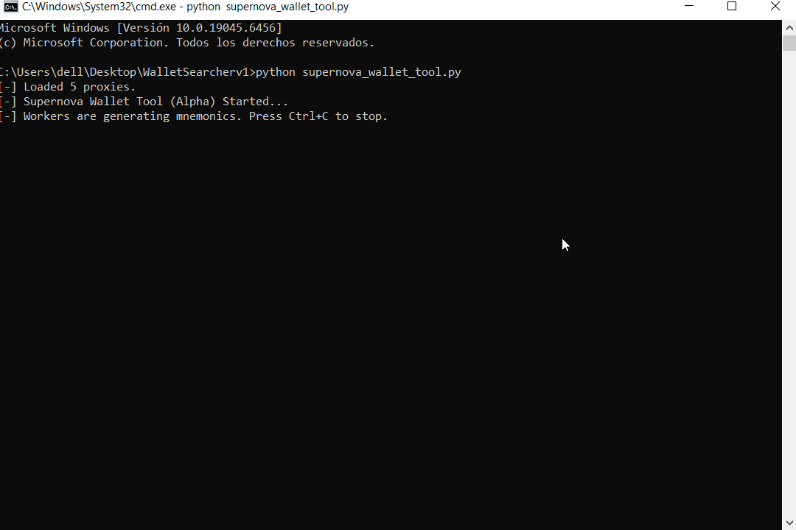

# 🌌 Supernova Wallet Tool (Alpha) ☄️

[](https://www.python.org/downloads/)
[](https://docs.python.org/3/library/asyncio.html)
[]()
[](LICENSE)



## 📖 Introduction
Supernova Wallet Tool is a high-performance audit tool designed for 'brain wallets', utilizing **Pattern-Based Mnemonic Logic** to effectively search for active wallets. Uniquely engineered for speed and accuracy, it leverages advanced cryptographic derivation and asynchronous networking to scan for lost or dormant assets across multiple blockchains.

## 🚀 New & Exclusive Features (1.0)

### 🔄 Proxy Rotation System (HTTP/SOCKS5)
Integrated support for rotating proxies to bypass API rate limits and ensure uninterrupted scanning. Compatible with both **HTTP** and **SOCKS5** proxy standards.

### 🕵️ Vanity Search (The 'Nube' Filter)
A powerful new filter allowing the saving of wallets with custom prefixes.
*   **Example**: Configure to save any wallet starting with `1Nube` found during the mnemonic generation process.

### ⚡ Private Node Support
Full integration with private node providers like **Alchemy** and **Infura**. This significantly boosts scanning speed and reliability compared to public RPC nodes.

### 📊 Industrial Logging
Enhanced logging capabilities that categorize findings into CSV files for easy analysis:
*   **Checked**: All processed wallets.
*   **Vanity Hit**: Wallets matching your custom vanity criteria.
*   **Balance Hit**: Wallets found with non-zero balances.

### ⚙️ Performance Architecture
*   **Multiprocessing**: Utilizes all available CPU cores for intensive cryptographic key derivation tasks.
*   **AsyncIO**: Handles thousands of network requests concurrently for maximum throughput.

## 🛠️ Installation & Setup

### Prerequisites
*   Python 3.10 or higher.
*   `pip` package manager.

### 1. Installation
Clone the repository and install the required dependencies:
```bash
git clone https://github.com/nubeoscuramail/UltraFast-Wallet-Hunter.git
cd Supernova-Wallet-Tool
pip install -r requirements.txt
```

### 2. Configuration (.env)
Create a `.env` file in the root directory and configure your API keys and settings. This is crucial for high performance.
```ini
# API Keys for Blockchain Providers
ETHERSCAN_API_KEY=your_etherscan_api_key
ETH_PROVIDER_URL=https://eth-mainnet.alchemyapi.io/v2/your_alchemy_key

# Vanity Search Settings
VANITY_PREFIX=1Nube
```

### 3. Proxy Setup
Create a `proxies.txt` file in the root directory. Add your proxies line by line in the following format:
```text
http://user:pass@ip:port
socks5://ip:port
```
*Note: High-quality rotating proxies are recommended for best results.*

## 📬 Contact
For bug reports, feature requests, or general inquiries:
*   **GitHub Issue**: Open an issue in this repository.
*   **GitHub DM**: Send a direct message.


---

> [!WARNING]
> ## ⚖️ Legal Disclaimer
>
> **EDUCATIONAL AND SECURITY RESEARCH USE ONLY.**
>
> This software is intended for **educational purposes** and for finding lost wallets that belong to **YOU**. Using this tool to access wallets that do not belong to you is illegal and unethical. The authors are not responsible for any misuse of this software or valid laws that may be broken by the user. **Use responsibly.**


